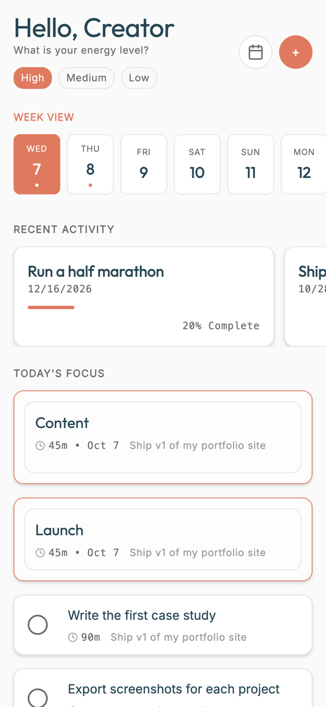
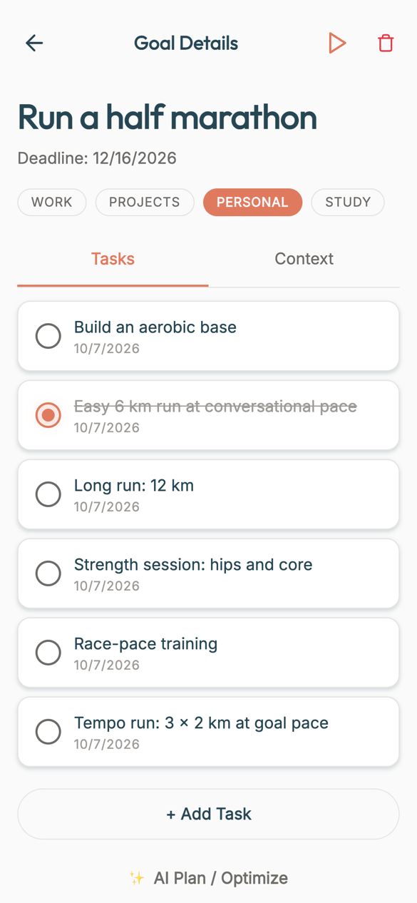
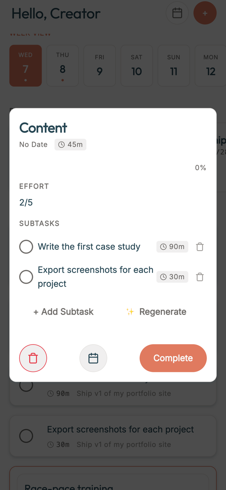

# Eôs (repo: timeDirector)

A React Native / Expo app that turns a goal into a plan: an LLM breaks the goal into milestones and tasks, and a scheduler places those tasks into the free slots of your week.

<p>
  
  
  
</p>

*Screenshots: the web build running in guest mode with demo data (October 2026).*

**Status: discontinued in 2026 after a private beta.** Retention was too low to keep going. The code stays here as a record of the product.

## What it does

- **Goal breakdown with an LLM.** You describe a goal in plain language; Gemini returns milestones and tasks with time estimates (`src/services/ai.ts`). "AI Plan / Optimize" re-runs the planning on an existing goal, and on a milestone "Split into Tasks" (then "Regenerate") asks the LLM for subtasks.
- **Scheduling.** `src/services/scheduler.ts` distributes tasks over the week according to your availability slots (work, projects, personal, study), in order and within each day's free minutes.
- **Daily focus.** The dashboard shows the week and today's focus list, with an energy level selector and focus sessions.
- **Quick capture.** Single tasks, a brain dump for several tasks at once, and habits with streaks.
- **Accounts and sync.** Google and Apple sign-in or guest mode; data is stored locally first and synced to Supabase when signed in (`storage.ts`, `syncManager.ts`).
- **Android build** through GitHub Actions and EAS.

## Stack

React Native 0.81 and Expo 54, TypeScript, Supabase (auth and Postgres), Google Gemini API, React Navigation, AsyncStorage.

## Run it

```bash
npm install
cp .env.example .env    # fill in your own keys
npx expo start --web    # or: npx expo start, then open on a device
```

Guest mode works without Google or Apple sign-in, but the app expects `SUPABASE_URL` and `SUPABASE_ANON_KEY` to be set at startup (placeholder values are enough for guest mode). The goal breakdown needs your own `GEMINI_API_KEY`.

## Known limitations

- The prototype calls Gemini directly from the client. In production this belongs behind a server function (for example a Supabase Edge Function) with per-user quotas, so the API key never ships in the app.

## Structure

```
src/
├── screens/      Dashboard, GoalInput, GoalDetails, FocusSession, Settings, Login, Onboarding
├── components/   modals (creation menu, brain dump, milestone details) and UI parts
├── services/     ai (Gemini), scheduler, storage, syncManager, supabase, auth, googleCalendar
├── context/      auth, theme, focus session
└── design-system/
```
